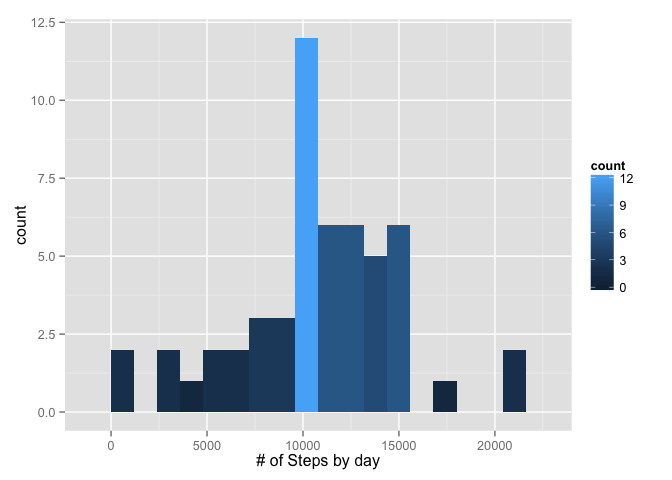
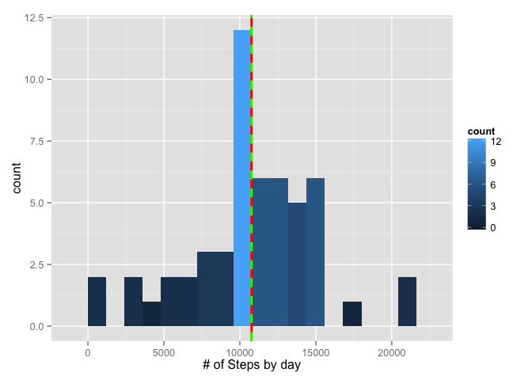
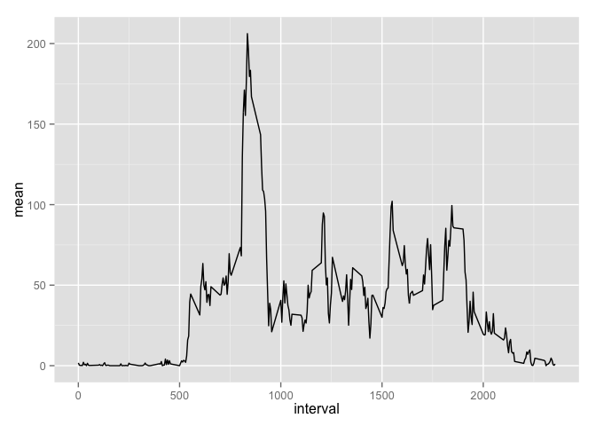
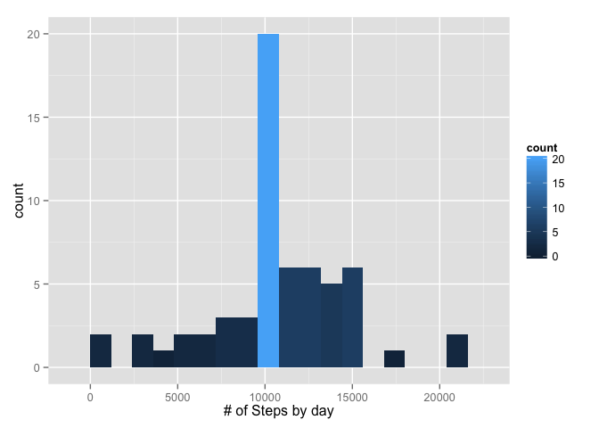
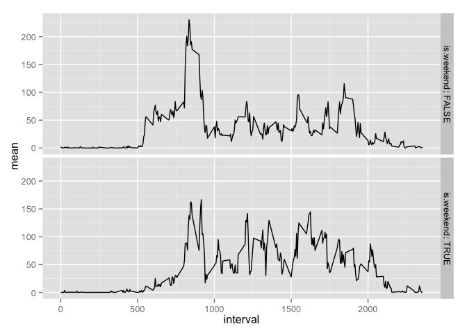

---
title: 'Reproducible Research: Peer Assessment 1'
output:
html_document:
keep_md: yes
---

### Loading Packages we're planning to make use of
We're using dplyr because of it's convenient group-by syntax

```r
library(dplyr)
```

```
## 
## Attaching package: 'dplyr'
## 
## The following object is masked from 'package:stats':
## 
##     filter
## 
## The following objects are masked from 'package:base':
## 
##     intersect, setdiff, setequal, union
```
Load lubridate to make data handling a lot easier

```r
library(lubridate)
```
Use the ggplot2 library. It makes nicer graphs

```r
library(ggplot2)
```


## Loading and preprocessing the data

We're just unzipping the file, and load the data from the resulting CSV. Then 
we apply the lubridate parsing on the date column

```r
unzip("activity.zip")
steps <- read.csv("activity.csv")
steps$date <- ymd(steps$date)
```

## What is mean total number of steps taken per day?

drop the NAs in the dataset when executing 

```r
steps.by.day <- na.omit(steps) %>% 
    group_by(date) %>% 
    summarise(total = sum(steps))


steps.by.day.hist = ggplot(steps.by.day, aes(x = total)) + 
    geom_histogram(aes(fill = ..count..), binwidth = 1200) +
    xlab("# of Steps by day")

print(steps.by.day.hist)
```

 

Mean and median of the steps.by.day:

```r
mean(steps.by.day$total)
```

```
## [1] 10766.19
```

```r
median(steps.by.day$total)
```

```
## [1] 10765
```

Drawn into the graph, mean is red, median green:

```r
steps.by.day.hist + 
    geom_vline(x = mean(steps.by.day$total), color = "red", size = 1) +
    geom_vline(x = median(steps.by.day$total), 
               color = "green", size = 1, linetype = 2)
```

 

But they are quite close together...

## What is the average daily activity pattern?

```r
steps.by.interval <- na.omit(steps) %>%
    group_by(interval) %>% 
    summarise(mean = mean(steps))

ggplot(steps.by.interval, aes(x = interval, y = mean)) +
    geom_line()
```

 

The interval with the highest number of steps on average is:

```r
steps.by.interval$interval[ which.max(steps.by.interval$mean) ]
```

```
## [1] 835
```

## Imputing missing values
Check for NAs in the dataset by variable.


```r
colSums(is.na(steps))
```

```
##    steps     date interval 
##     2304        0        0
```

As we can see, we got 2304 values missing in the steps column of the data frame.

Let's fill the missing values of the interval with the average of the interval
across all days.


```r
steps.interpolated <- steps

for ( x in which(is.na(steps)) ) {
    steps.interpolated$steps[x] <- 
        steps.by.interval$mean[ steps.by.interval$interval == 
                                    steps.interpolated$interval[x] ]
}

steps.interpolated.by.day = na.omit(steps.interpolated) %>% 
    group_by(date) %>% 
    summarise(total = sum(steps))

ggplot(steps.interpolated.by.day, aes(x = total)) + 
    geom_histogram(aes(fill = ..count..), binwidth = 1200) +
    xlab("# of Steps by day")
```

 

```r
mean(steps.interpolated.by.day$total)
```

```
## [1] 10766.19
```

```r
median(steps.interpolated.by.day$total)
```

```
## [1] 10766.19
```

Depending on the method used for imputing missing values, the mean and median 
may change or not. The simple method used here did not change anything obvious.


```r
summary(steps.by.day)
```

```
##       date                         total      
##  Min.   :2012-10-02 00:00:00   Min.   :   41  
##  1st Qu.:2012-10-16 00:00:00   1st Qu.: 8841  
##  Median :2012-10-29 00:00:00   Median :10765  
##  Mean   :2012-10-30 17:12:27   Mean   :10766  
##  3rd Qu.:2012-11-16 00:00:00   3rd Qu.:13294  
##  Max.   :2012-11-29 00:00:00   Max.   :21194
```

```r
summary(steps.interpolated.by.day)
```

```
##       date                total      
##  Min.   :2012-10-01   Min.   :   41  
##  1st Qu.:2012-10-16   1st Qu.: 9819  
##  Median :2012-10-31   Median :10766  
##  Mean   :2012-10-31   Mean   :10766  
##  3rd Qu.:2012-11-15   3rd Qu.:12811  
##  Max.   :2012-11-30   Max.   :21194
```

## Are there differences in activity patterns between weekdays and weekends?


```r
steps.interpolated$is.weekend <- wday(steps.interpolated$date) %in% c(1, 7)

steps.interpolated.by.interval <- steps.interpolated %>%
    group_by(interval, is.weekend) %>% 
    summarise(mean = mean(steps))

ggplot(steps.interpolated.by.interval, aes(x = interval, y = mean)) +
    geom_line() + facet_grid(is.weekend ~ ., labeller = label_both)
```

 

